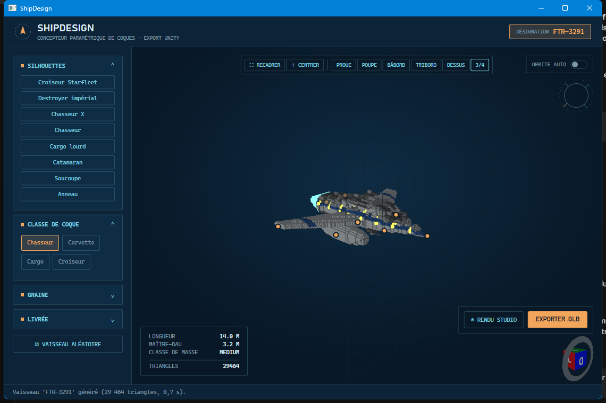
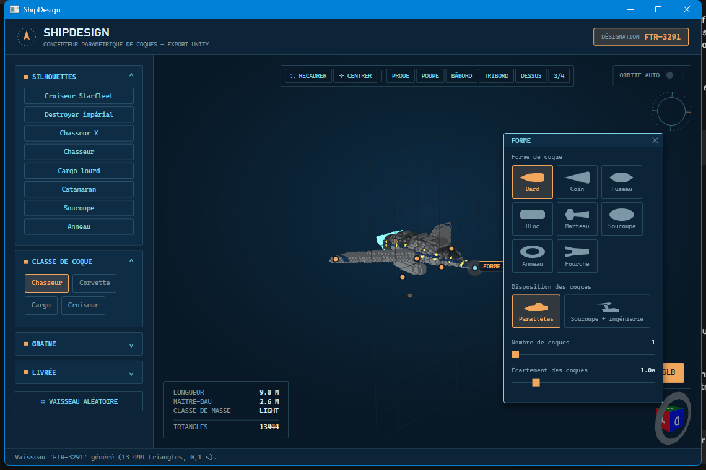
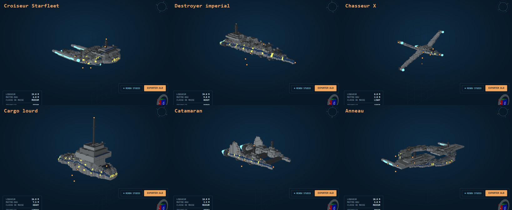
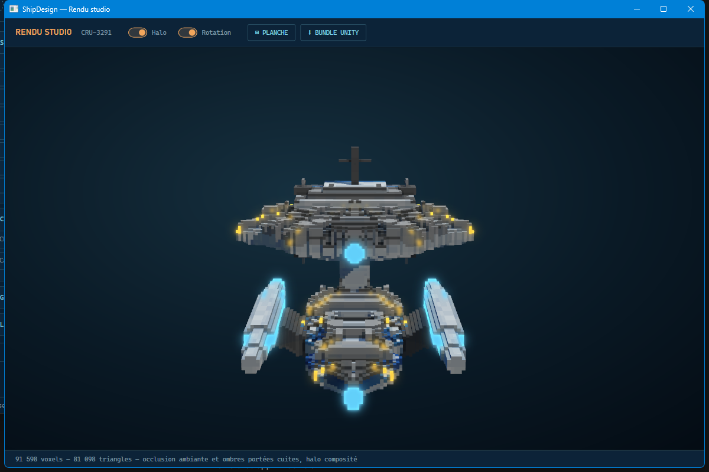
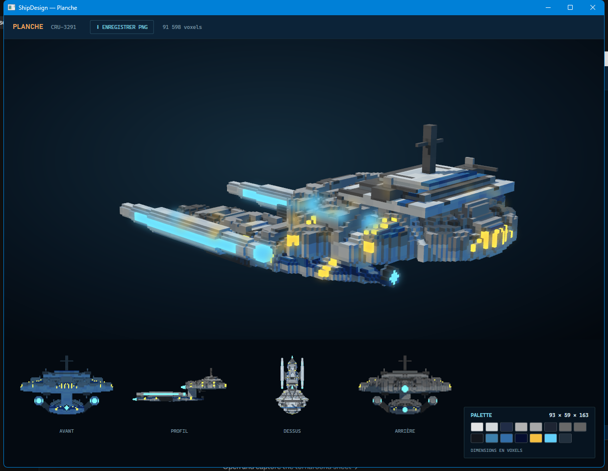
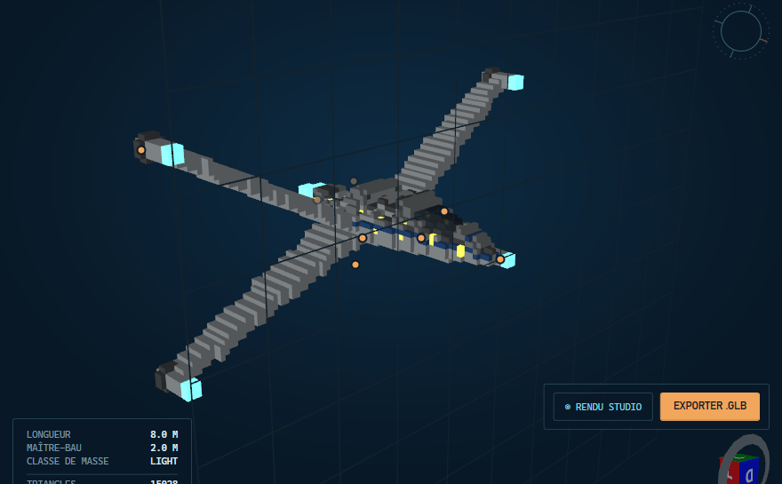

# ShipDesign

Générateur procédural de vaisseaux spatiaux en voxels, en .NET 7 / WPF, avec export `.glb` pour
Unity.

Rien n'est modélisé à la main : la coque, les ailes, les nacelles sur pylônes, les moteurs, le
cockpit, la tourelle de commandement, les canons et le détail de surface sont tous construits par
le code à partir d'une cinquantaine de paramètres continus. Deux vaisseaux ne diffèrent que par
ces valeurs et par une graine.



## Sommaire

- [Démarrer](#démarrer)
- [Les réglages sont posés sur le vaisseau](#les-réglages-sont-posés-sur-le-vaisseau)
- [Silhouettes](#silhouettes)
- [Naviguer dans la vue 3D](#naviguer-dans-la-vue-3d)
- [Rendu studio](#rendu-studio)
- [Planche de présentation](#planche-de-présentation)
- [Détail : les canons en bout d'aile](#détail--les-canons-en-bout-daile)
- [Exporter vers Unity](#exporter-vers-unity)
- [Utiliser le générateur sans l'interface](#utiliser-le-générateur-sans-linterface)
- [Architecture](#architecture)
- [Pourquoi des voxels](#pourquoi-des-voxels)
- [Étendre le générateur](#étendre-le-générateur)

## Démarrer

```bash
dotnet run --project src/ShipDesign.App
```

Le vaisseau se régénère à chaque changement de paramètre. La génération tourne sur un thread de
travail : la fenêtre reste utilisable pendant qu'un gros vaisseau se construit, et un gabarit dont
l'encombrement dépasserait le budget est refusé avec un message qui nomme la dimension fautive
plutôt que de faire ramer l'application.

## Les réglages sont posés sur le vaisseau

Le rail de gauche ne garde que ce qui n'a pas de pièce à désigner : silhouettes, classe de coque,
graine, livrée. Tout le reste vit sur le vaisseau lui-même, sous forme d'épingles discrètes posées
sur la pièce que les réglages contrôlent. Cliquer une épingle ouvre son panneau, relié par un trait
de rappel.



Huit groupes, huit points d'ancrage : **Forme** (proue), **Dimensions** (maître-bau), **Ailes**
(bout d'aile), **Propulsion** (poupe), **Cockpit**, **Tourelle**, **Nacelles** (nacelle) et
**Surface** (pont arrière).

Quelques comportements voulus :

- Le panneau est placé **une seule fois** à l'ouverture puis figé. Ses réglages déplacent la pièce à
  laquelle il est accroché ; un panneau qui suivrait son ancre glisserait sous le curseur en plein
  geste.
- L'épingle **reste** même quand la pièce est désactivée — sans quoi, ailes décochées, il n'y aurait
  plus aucun moyen de les rallumer. Elle se replie alors sur la racine, là où la pièce s'attache.
- Les épingles situées de l'autre côté de la coque sont **atténuées**, et deux épingles qui se
  superposent à l'écran sont écartées de façon déterministe.
- L'orbite automatique est **suspendue** tant qu'un panneau est ouvert, sans toucher à la valeur de
  l'interrupteur. `Échap` referme.

## Silhouettes

Huit préréglages posent d'un clic la vingtaine de paramètres qui font un type reconnaissable, sans
toucher à la graine ni à la livrée, qui appartiennent à l'utilisateur. Le rail les range par
univers, un pli repliable par franchise.



| Univers | Silhouette | Ce qui la caractérise |
|---|---|---|
| Star Trek | Croiseur Starfleet | Soucoupe + coque d'ingénierie reliées par un col, nacelles warp sur pylônes en lame, déflecteur |
| Star Wars | Destroyer impérial | Coin plat à quille plate, passerelle tout à l'arrière, dômes senseurs |
| Star Wars | Chasseur X | Fuselage court, quatre ailerons en croix, canons en bout d'aile |
| Archétypes | Chasseur | Coque fine, ailes en flèche, verrière bulle |
| Archétypes | Cargo lourd | Corps cubique, tourelle massive, mât d'antenne |
| Archétypes | Catamaran | Deux coques parallèles reliées par des entretoises |
| Archétypes | Soucoupe | Disque à terrasses concentriques et nervures radiales |
| Archétypes | Anneau | Roue : bande annulaire, rayons, moyeu et fuseau axial — une station, sans propulsion |

Trois façons de laisser le hasard décider, du plus doux au plus brutal :

| | Ce qui bouge | Où |
|---|---|---|
| ↻ à côté de la graine | La graine seule : les greebles, et le placement fin des ailes et de la tour | Rail, section Graine |
| **Variante** | Les proportions, d'au plus 18 %, plus une graine neuve. Formes, styles et interrupteurs intacts | Vue 3D, en haut à gauche |
| **Vaisseau aléatoire** | Tout, silhouette comprise | Rail, en bas |

**Variante** est celle qu'on presse en boucle : elle donne un autre individu de la même classe, pas
un autre vaisseau. Les comptes (ponts, tuyères, tourelles) ne bougent que d'une unité — un chasseur
qui passerait de deux à six tuyères ne serait plus une variation de quoi que ce soit.

Le **Vaisseau aléatoire** tire l'ensemble des axes, en resserrant les choix incohérents : une coque
composée ne reçoit pas d'ailes, et ses deux coques ne sont pas tirées indépendamment, sans quoi on
obtient deux dalles partageant un col plutôt qu'un vaisseau.

### La roue

La forme de coque **Anneau** est une roue, pas un tore : des rayons traversent le trou et portent un
moyeu au centre — le noyau autour duquel la bande tourne. Nombre de rayons, présence et taille du
moyeu se règlent dans le panneau **Forme**, qui ne montre ces contrôles que pour une coque annulaire.

Un moyeu réclame au moins trois rayons et les impose s'il en manque : sans eux il serait détaché de
la bande, et le balayage de fragments le supprimerait purement et simplement — la case à cocher
n'aurait alors aucun effet visible.

Le contour d'un disque — soucoupe comme anneau — suit exactement son profil, sans l'ondulation que
les autres coques reçoivent : un cercle qui ondule n'en est plus un. Le diamètre vaut la longueur,
et le maître-bau ne s'applique pas.

Le nombre de tuyères descend à **zéro** : une station ne va nulle part, et lui en imposer une posait
une tuyère d'échappement sur quelque chose d'immobile. C'est ce que la silhouette Anneau demande.

**Une roue n'a pas de haut.** C'est ce qui la distingue d'un vaisseau, et les structures qui
supposent un dessus sont donc traitées à part sur une coque annulaire : pas d'arête dorsale, et la
tourelle de commandement n'est pas plantée sur la jante mais devient un **fuseau traversant le
moyeu**, sortant autant d'un côté que de l'autre, avec un feu identique à chaque extrémité. Le
plan de la roue reste ainsi un plan de symétrie.

## Naviguer dans la vue 3D

La barre en haut de la vue donne le cadrage et les angles :

- **Recadrer** cadre le vaisseau entier sans changer l'angle.
- **Centrer** le ramène au milieu sans changer la distance.
- **Proue**, **Poupe**, **Bâbord**, **Tribord**, **Dessus**, **3/4** posent l'angle *et* recadrent.

À la souris : glisser pour tourner, molette pour zoomer **vers le pointeur**, bouton du milieu pour
déplacer. L'orbite tourne autour du vaisseau et non de l'origine du monde — sur un destroyer
impérial, celle-ci tombe à peu près sur la proue.

## Rendu studio

Une seconde fenêtre reconstruit sa propre géométrie depuis la grille de voxels, pour cuire ce que
la vue principale ne peut pas montrer : **occlusion ambiante** par voxel, **ombres portées** par
lancer de rayon, et un **halo composité** en passe séparée.



## Planche de présentation

Depuis le studio, la planche assemble une vue héroïque et quatre élévations orthographiques, plus la
palette et les dimensions en voxels. Elle s'enregistre en PNG rendu au double de sa taille écran —
la géométrie voxel n'est faite que d'arêtes franches à fort contraste, le pire cas pour l'aliasing.



## Détail : les canons en bout d'aile

Quatre canons sur une aile en croix, deux sur une aile pleine ou une paire d'ailerons, museau
émissif à l'avant et collier sombre à la jonction. Le calibre est plafonné par l'écart réel entre
les bouts : sans cela, un gros calibre sur une petite coque ne donne pas des canons plus gros mais
un bloc unique.



## Exporter vers Unity

- **Exporter .glb** — le maillage seul. Il s'importe par glisser-déposer dans `Assets/`.
- **Bundle Unity** (depuis le studio) — un dossier contenant le `.glb`, le shader URP
  `VoxelShipURP.shader`, les matériaux `.mat` avec leurs `.meta`, un `materials.json` et un
  `LISEZMOI.md`.

L'occlusion ambiante et la variation de teinte par bloc voyagent dans l'attribut `COLOR_0` du glTF,
comme un multiplicateur RVB ; le shader fourni fait `albedo.rgb *= vertex`. Sans lui, le maillage
s'affiche correctement mais à plat.

## Utiliser le générateur sans l'interface

`ShipDesign.Core` est un `net7.0` ordinaire, sans aucune dépendance WPF — utilisable tel quel depuis
une CLI, un test ou un pipeline.

```csharp
using ShipDesign.Core.Procedural;

var p = new ShipParameters
{
    HullClass = HullClass.Cruiser,
    HullArrangement = HullArrangement.Composite,
    HullShape = HullShape.Saucer,
    Length = 24f,
    Beam = 6f,
    Depth = 2.4f,
    Nacelles = true,
    NacelleMount = NacelleMount.Secondary,
    NacelleStyle = NacelleStyle.Warp,
    Seed = 3291,
};

// Le modèle glTF complet.
ProceduralShipBuilder.Build(p).SaveGLB("croiseur.glb");

// Ou la grille de voxels brute, avant tout maillage.
var grid = ProceduralShipBuilder.BuildVoxels(p, out var anchors);
Console.WriteLine($"{grid.Voxels.Count} voxels, proue à {anchors.Bow}");
```

Une silhouette s'applique à un jeu de paramètres existant sans écraser la graine ni les couleurs :

```csharp
ShipSilhouette.All.First(s => s.Name == "Chasseur X").ApplyTo(p);
```

## Architecture

```
src/ShipDesign.Core/Procedural/     net7.0, sans WPF
  VoxelShipGrower.cs                le générateur : une passe par pièce
  VoxelGrid.cs / VoxelMaterial.cs   la grille et sa palette de matériaux
  VoxelMesher.cs                    maillage par faces visibles vers glTF
  VoxelAmbientOcclusion.cs          occlusion par coin, façon Minecraft
  VoxelShadowCaster.cs              ombres portées par lancer de rayon
  VoxelTint.cs / ColorMath.cs       variation de teinte par bloc
  ShipParameters.cs                 tous les réglages
  ShipSilhouette.cs                 les huit préréglages
  ShipAnchors.cs                    où chaque groupe de réglages s'accroche
  ProceduralShipBuilder.cs          point d'entrée
  UnityBundleExporter.cs            .glb + shader + .mat + .meta

src/ShipDesign.App/                 net7.0-windows, WPF + HelixToolkit
  MainWindow.xaml(.cs)              rail, vue 3D, épingles, cadrage
  ParameterPanels.xaml              les huit panneaux ancrés
  StudioWindow / SheetWindow        rendu studio et planche
  Rendering/                        maillage studio, palette, bloom
```

`VoxelShipGrower` est le cœur : `Grow` enchaîne les passes — remplissage des coques, structures de
disque, terrasses, col, déflecteur, arête dorsale, ailes, canons, nacelles, tourelle, moteurs,
cockpit, détail de surface, tourelles d'armement — puis termine par un balayage qui supprime tout ce
qui n'est pas connexe au corps principal. Ce balayage est un filet de sécurité assumé : une douzaine
de passes posent chacune leur structure, et « cette pièce touche la coque » s'est révélé faux de
plusieurs manières différentes.

La résolution est fixée par `VoxelShipGrower.VoxelSize` (0,15 unité). Le passage voxel → monde est
une simple multiplication, sans aucune transformation intermédiaire.

## Pourquoi des voxels

Une coque lissée obtenue par révolution donne un fuselage d'avion : un langage aérodynamique qui n'a
pas de sens dans le vide, et qui ne correspond pas au space opera. Les versions antérieures
construisaient des sections en octogone chanfreiné ; la grille de voxels les a remplacées parce
qu'elle donne gratuitement ce qu'il fallait sinon fabriquer — des arêtes franches, une lecture
« assemblé par blocs », un détail de surface qui se pose par simple écriture de voxels, et une
occlusion ambiante qui se calcule sur le voisinage plutôt que sur une soupe de triangles.

## Étendre le générateur

- **Nouveau réglage** : ajouter une propriété à `ShipParameters`, la lire dans la passe concernée,
  et exposer une propriété correspondante dans `MainViewModel` (qui appelle `Rebuild()`). Le
  clonage pour le thread de travail et la copie par les silhouettes passent tous deux par la
  réflexion : un paramètre ajouté est pris en compte sans que personne ait à y penser.
- **Nouvelle forme de coque, style d'aile, de moteur…** : ajouter la valeur à l'enum et le cas dans
  la passe. Les sélecteurs de l'interface itèrent sur `Enum.GetValues<T>()` et se mettent à jour
  seuls ; penser au libellé français dans
  [EnumLabelConverter](src/ShipDesign.App/Converters/EnumLabelConverter.cs).
- **Nouvelle silhouette** : une entrée dans `ShipSilhouette.All`, préfixée par son univers. Les
  univers sont de simples chaînes (`ShipSilhouette.StarTrek`, `StarWars`, `Archetypes`, ou
  n'importe quelle autre) et les groupes du rail sont dérivés de la liste : ajouter une silhouette
  dans un univers encore inexistant fait apparaître son pli tout seul, sans rien déclarer ailleurs.

  ```csharp
  Of("Babylon 5", "Croiseur Whitestar",
     "Coque organique effilée, ailes portantes vers l'avant",
     p => { p.HullShape = HullShape.Dart; /* ... */ }),
  ```
- **Nouvelle pièce** : une passe dans `VoxelShipGrower`, appelée depuis `Grow`. La seule règle qui
  compte est de l'asseoir sur la surface **réelle** (`TopFilledY`) et non sur l'enveloppe : la
  ligne de pont de l'enveloppe et la surface sur laquelle une structure repose ne sont pas à la
  même hauteur dès que la coque est chanfreinée ou creuse.

## Ce qui manque encore

- Pas d'annulation : chaque changement régénère directement.
- Palette de livrée limitée à huit pastilles par canal, sans sélecteur libre.
- Le rendu de référence reste celui de WPF, à fonction fixe. Un rendu de qualité supérieure
  demanderait HelixToolkit.SharpDX, un rendu dans Unity, ou un rendu hors ligne — arbitrage non
  tranché.
